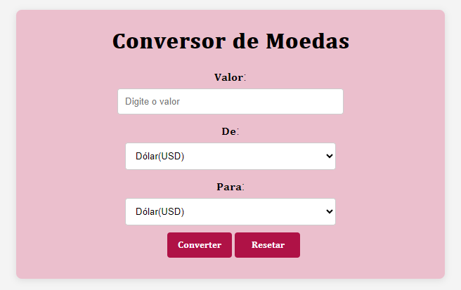

# Conversor de Moedas

## Descrição Geral

Este é um projeto de aplicação web simples para conversão de moedas, desenvolvido com HTML5, CSS3 e JavaScript puro. A aplicação permite que o usuário insira um valor em uma moeda específica e obtenha o valor convertido em outra moeda, usando taxas de câmbio fixas predefinidas.



## Funcionalidades

- Entrada de Valor: Permite que o usuário insira o valor que deseja converter.
- Seleção de Moedas: O usuário pode escolher tanto a moeda de origem quanto a moeda de destino, entre as opções de moedas predefinidas (ex.: Dólar, Euro, Real).
- Conversão de Moedas: Realiza a conversão de acordo com uma taxa de câmbio fixa definida no código.
- Reset: Permite ao usuário redefinir o valor e as seleções de moedas para iniciar uma nova conversão.

## Requisitos Técnicos
- HTML5: Utilizado para estruturar a página, com campos de formulário para entrada de valor e seleção de moedas. Elementos semânticos como ``<form>``, ``<input>``, ``<select>``, etc., foram empregados.
- CSS3: Aplicado para uma estilização simples, porém atraente, garantindo uma interface organizada e responsiva que se adapta a dispositivos móveis e desktops.
- JavaScript Puro: Implementa a lógica de conversão de moedas, realizando os cálculos e atualizando a interface em tempo real por meio da manipulação do DOM.

## Estrutura do Projeto
- index.html: Arquivo HTML com a estrutura básica da aplicação.
- style.css: Arquivo CSS para a estilização da interface.
- script.js: Arquivo JavaScript contendo a lógica de conversão de moedas.

## Estrutura do Código
**HTML:** Inclui campos de formulário para entrada de valores e seleção de moedas, além de botões de ação.

**CSS:** Responsável por estilizar os campos e organizar a interface para que fique clara e fácil de usar.

**JavaScript:**
``exchangeRates:`` Objeto que contém as taxas de câmbio fixas.
Função para realizar a conversão e exibir o valor convertido na interface.
Função de reset para redefinir os campos de entrada e o resultado.

## Taxas de Câmbio Fixas
As taxas de câmbio fixas entre as moedas USD, BRL e EUR estão definidas diretamente no código JavaScript da seguinte maneira:
```JavaScript
const exchangeRates = {
    USD: { BRL: 5.70, EUR: 0.93 },
    BRL: { USD: 0.18, EUR: 0.16 },
    EUR: { USD: 1.08, BRL: 6.16 }
};
```

## Exemplo de Uso
1. Digite o valor a ser convertido (ex: 50) no campo "Valor".
2. Escolha USD como moeda de origem e BRL como moeda de destino.
3. Clique em "Converter". O sistema exibirá o valor convertido com base na taxa fixa, por exemplo, Resultado: 285.00 BRL.
4. Clique em "Reset" para limpar e realizar uma nova conversão.

### **Autores:**

[Nayra Vitória dos Santos](https://github.com/nayravsantos)

[Leonardo Santiago Sidon da Rocha](https://github.com/leonardossrocha)
